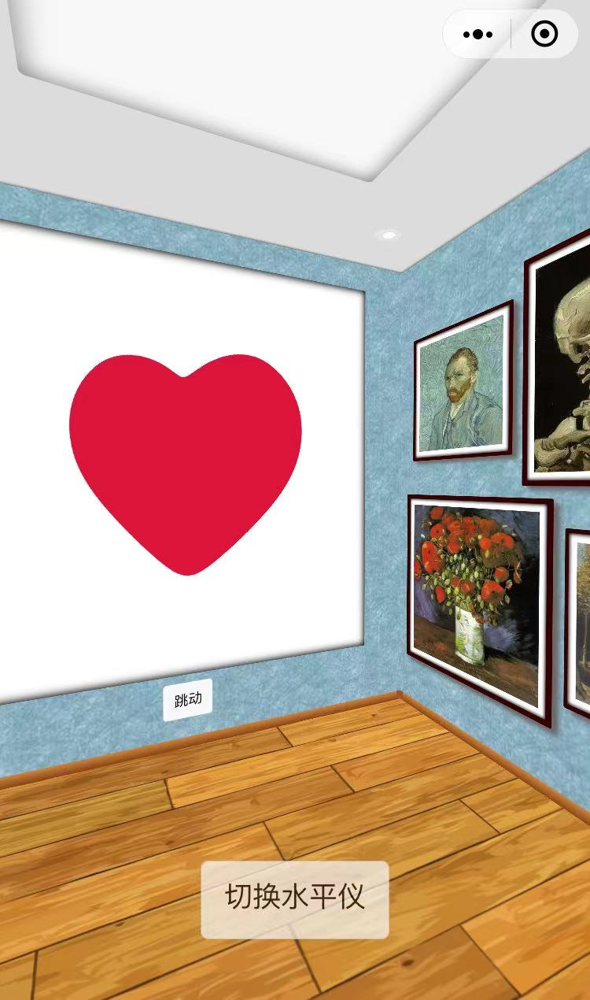
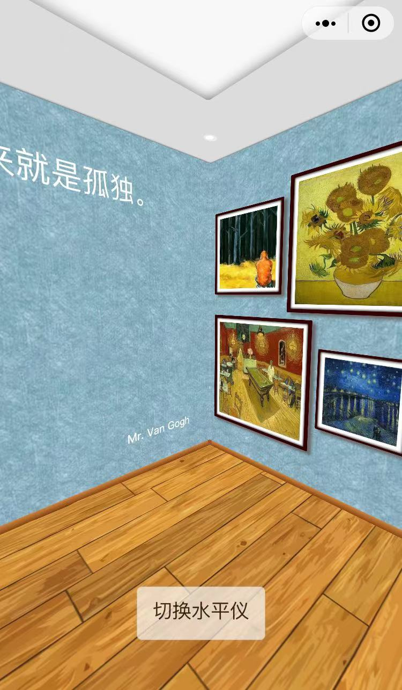

# visual-3d
可视化的微信小程序实践项目。

## 预览

微信小程序搜索visual3D或扫描下方二维码

## 其他

该项目使用的threejs小程序版出自@yannliao，[项目地址](https://github.com/yannliao/threejs.miniprogram)。

这个项目当时做的比较着急，代码没有整理很乱，有问题提issues交流。

## 许可

[MIT](./LICENSE)

Copyright (c) 2022 - Boda Lü